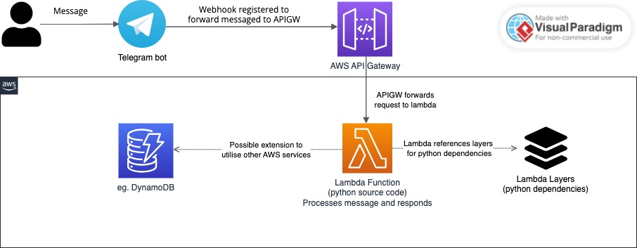

## Context
Telegram bots offer a fast and efficient way to prototype applications without requiring custom UI or authentication. They can be deployed on a virtual machine to maintain state or in a serverless environment. A serverless Telegram bot hosted on AWS Lambda benefits from 1 million free compute requests and supports concurrent execution, unlike stateful bots on VMs with limited compute capacity. However, configuring a serverless setup can be time-consuming.

This template simplifies the deployment of a serverless Telegram bot, providing a solid foundation for users familiar with Infrastructure as Code (IaC) and AWS. It also serves as a quick-start guide for those looking to deploy a simple Telegram bot. However, extensive customization may require additional onboarding to gain familiarity with Terraform.

### Architectural Overview

## Pre-requisites
1. Terrform - refer to [installation guide](https://developer.hashicorp.com/terraform/tutorials/aws-get-started/install-cli).
1. AWS Account credentials see [AWS Build infrastructure tutorial](https://developer.hashicorp.com/terraform/tutorials/aws-get-started/aws-build). 
    - AWS_ACCESS_KEY_ID
    - AWS_SECRET_ACCESS_KEY
1. Create an AWS Bucket to store terraform state file (Note the bucket name)
1. TELEGRAM_BOT_TOKEN - Generated from bot father see section on [obtaining bot token](https://core.telegram.org/bots/tutorial#obtain-your-bot-token).
1. TELEGRAM_BOT_NAME - The name of your telegram bot to be used for naming AWS infrastructure.

## Getting started
This section explains how to get from an AWS token and telegram the ensure pre-requisites are met
### Initialise Python Virtual Environment and requirements.txt
The `requirements.txt` file will be referenced during infrastructure deployment to ensure required dependencies are present in [lambda layers](https://docs.aws.amazon.com/lambda/latest/dg/chapter-layers.html).
    Navigate to source directory, install and activate virtual environment
    `cd source`
    `pip3 -m venv venv`
    `source venv/bin/activate`
    
    Install initial dependencies and any additional dependencies into venv
    `pip3 install -r requirements.txt`
    `pip3 install <your dependencies>`
    
    Export all dependencies requirements.txt
    `pip3 freeze > requirement.txt`

### Deploy telegram bot via terraform
1. Export AWS credentials to terminal
1. Replace state file reference in `main.tf`
1. Create a new file by name `terraform.tfvars` and populate variables `bot_token` and `bot_name`. See `terraform.tfvars.example` for reference. 
1. `terraform init` and `terraform apply`. Optionally run `terraform validate` and `terraform plan` to verify config before apply.

## Developer guide
This section explains the elements of the template to aid in providing context required to perform customisations.

### Main.tf
Terrform provider configuration with remote state file definitions.

### Scripts
`prepare_layers.sh` - bash script to install AWS Linux compatible python depedencies for lambda layers
`register_telebot.sh` - bash script to set webhook enabling telegram server to foward messaged send to our bot to our API Gateway

### terraform_data.tf
Invokes the scripts in above section on [scripts](###Scripts) based on lifecycle triggers. Only runs layers script if there is a change in requirements.txt

### apigw.tf
API gateway paths configured to invoke lambda function.

### lambda.tf
Lambda layers, function and role configuration to execute source code. Update lambda role if you plan to integrate lambda
other AWS services (eg. DynamoDB).

### data.tf
Script to package source code and dependencies requireed for lambda source and layers. Source code packaging excludes venv folder. Update file if your virtual environment is of a different name. 